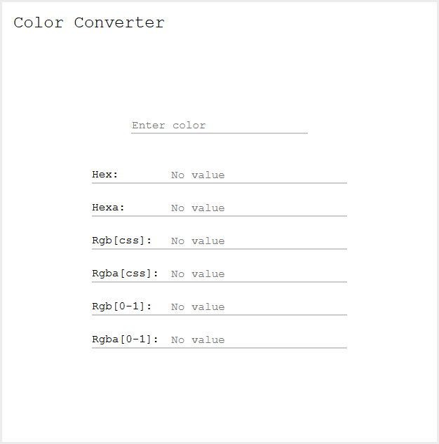
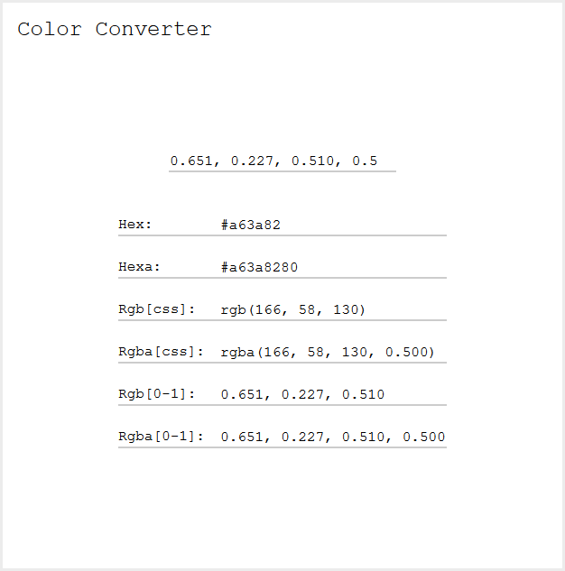

*************************************************
Color Converter
*************************************************
A website that converts between different color formats.

=================================================
Color Formats
=================================================
Following formats are supported as both input and output, unless otherwise specified.

Hexadecimal Notation
=================================================
+------------------+-----------------------------------------------------------+
| Notation         | Description                                               |
+==================+===========================================================+
| #RRGGBB          | Each pair of ``R(ed)``, ``G(reen)`` and ``B(lue)``        |
|                  | is an integer between 0 and 255 in base 16.               |
|                  | Values are given as pairs, therefore single digit values  |
|                  | need to be padded with a leading zero.                    |
|                  |                                                           |
|                  | **Examples**, decimal values to the left and their        |
|                  | hexadecimal translation to the right: ``255 = FF``,       |
|                  | ``0 = 00`` and ``10 = 0A``.                               |
+------------------+-----------------------------------------------------------+
| #RRGGBBAA        | Same as ``#RRGGBB`` but with an additional pair           |
|                  | representing ``Alpha``.                                   |
|                  | Alpha follows the same convention as the color values.    |
+------------------+-----------------------------------------------------------+
| #RGB             | Shorter version of ``#RRGGBB`` where each values is       |
|                  | expanded.                                                 |
|                  |                                                           |
|                  | **Example**: ``#B03`` is equal to ``#BB0033``.            |
|                  | **Note**: Supported as input but not output.              |
+------------------+-----------------------------------------------------------+
| #RGBA            | Shorter version of ``#RRGGBBAA`` where each values is     |
|                  | expanded.                                                 |
|                  |                                                           |
|                  | **Example**: ``#9F08`` is equal to ``#99FF0088``.         |
|                  | **Note**: Supported as input but not output.              |
+------------------+-----------------------------------------------------------+

Functional Notation
=================================================
Notation is based on the standard defined by `W3C Color Module <https://www.w3.org/TR/css-color-3/#rgb-color>`_.
Not all variations are implemented for the input but the output format will be a valid format according to the standards.

+------------------+-----------------------------------------------------------+
| Notation         | Description                                               |
+===========+======+===========================================================+
| rgb(R, G, B)     | Each value ``R(ed)``, ``G(reen)`` and ``B(lue)``          |
|                  | is an integer between 0 and 255.                          |
+------------------+-----------------------------------------------------------+
| rgba(R, G, B, A) | Same as ``rgb()`` but with an additional value that       |
|                  | represents ``Alpha``.                                     |
|                  | The alpha value is a decimal number between 0 and 1.      |
+------------------+-----------------------------------------------------------+

Float Notation
=================================================
Notation is based on vectors that define colors using float values.
An example would be the ``vec3`` and ``vec4`` data type specified by `GLSL <https://www.khronos.org/opengl/wiki/Data_Type_(GLSL)>`_.

+------------------+-----------------------------------------------------------+
| Notation         | Description                                               |
+===========+======+===========================================================+
| R, G, B          | Each value ``R(ed)``, ``G(reen)`` and ``B(lue)``          |
|                  | is a float between 0 and 1.                               |
+------------------+-----------------------------------------------------------+
| R, G, B, A       | Same as ``R, G, B`` but with an additional value that     |
|                  | represents ``Alpha``.                                     |
|                  | The alpha value uses the same format as the colors.       |
+------------------+-----------------------------------------------------------+
